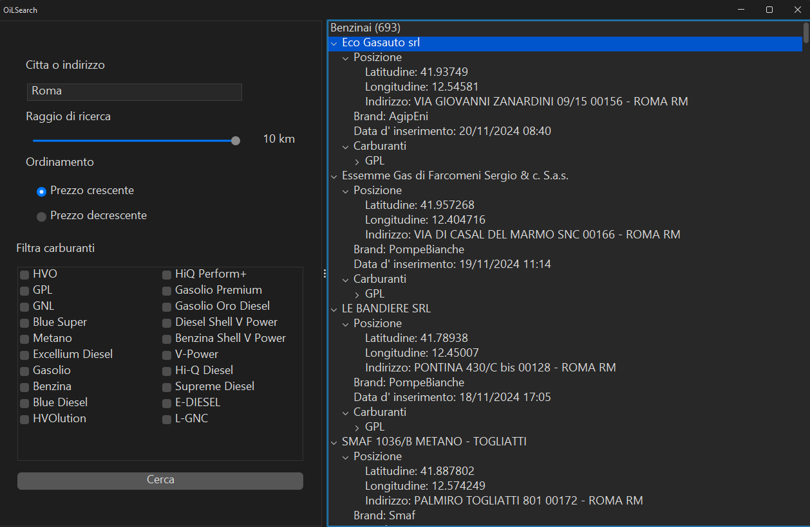

<h1>OiLSearch 2.0</h1>

<a>OiLSearch 2.0 è la versione software del progetto <b>OilSearch</b></a>

<a>Come la precedente versione utilizza <a href='https://carburanti.mise.gov.it/ospzSearch/home'>Osservaprezzo Carburanti</a>, un' API pubblica per la ricerca di distributori in un raggio di km.</a>
<a>In oltre per la geolocalizzazione delle città/indirizzi ho utilizzata un API gratuita <a href='https://opencagedata.com'>OpenCage Geocoding API</a>, quest' ultima necessita di un token rilasciato durante la registrazione per effettuare le richieste HTTP</a>
<a>OiLSearch è stato sviluppato usando la libreria per lo sviluppo di interfacce grafica <b>Java Swing</b></a>

<h4>Funzionalità</h4>
<ul>
  <li>Ricerca distibutori</li>
  <li>Autocompletamento in base a una lista con tutti i comuni italiani</li>
  <li>Memorizzazione dei nuovi indirizzi utilizzati per la ricerca</li>
  <li>Filtrare i carburanti trovati</li>
  <li>Decidere il senso di ordinamento, crescente (dal più conveniente) o decrescente (dal meno conveniente)</li>
  <li>In oltre permette di visualizzare comodamente con un doppio click sul treepath del distributore poi sucessivamente coordinate > posizione > indirizzo, la mappa di Google Maps aperta con il browser predefinito del sistema operativo</li>
</ul>
